# Welcome to my TEAM PROFILE GENERATOR!

## Description

#### This Team Profile Generator allows a manager to generate a webpage that displays their team's basic information so they can have quick access to their emails and GitHub profiles.
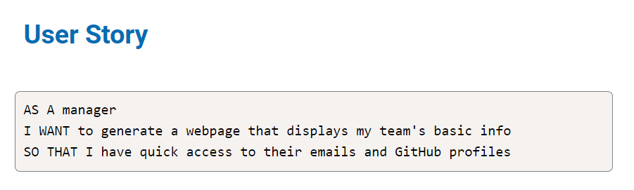

## Table of Contents
* [Installation](#installation)
* [Usage](#usage)
* [License](#license)
* [Contributor](#contributor)
* [Testing](#testing)
* [Demo](#demo)

## Installation
In order to run this Team Profile Generator, you will need to install node.js.

## Usage
To use this app, clone this repository and run node index.js on the command-line to start.

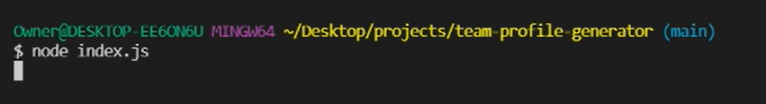

You will then start the generator and be asked to choose the role that you would like to enter first.

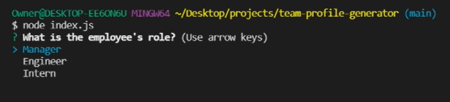

When selecting Manager, you will be asked to enter the Manager's name, ID, email, and office number. 

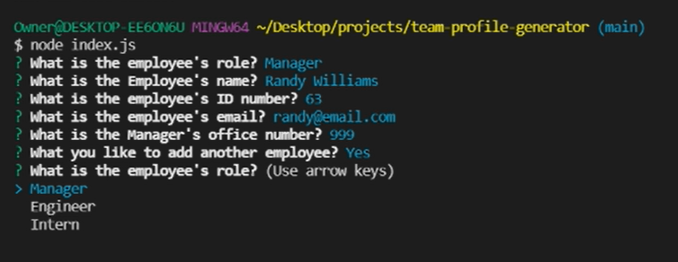

If you wish to enter another employee, you will be asked to choose the role. If you choose Engineer, you will be asked to enter the Engineer's name, ID, email, and GitHub.

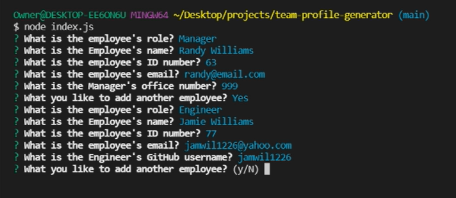

If you wish to enter another employee, you will be asked to choose the role. If you choose Intern, you will be asked to enter the Intern's name, ID, email, and school.

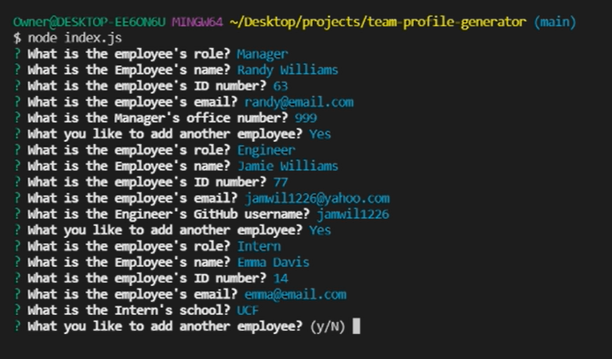

You can continue to enter as many employees as you would like to generate. When you are done and choose not to enter additional employees, you will be given a message that the Team Profile has been generated in the index.html.

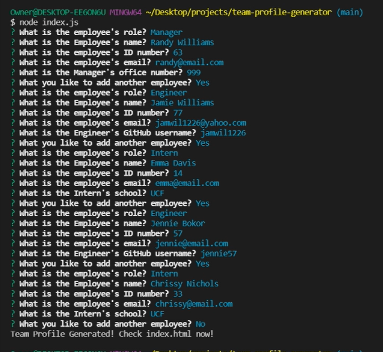

You will see an index.html file appear inside the 'dist' folder.

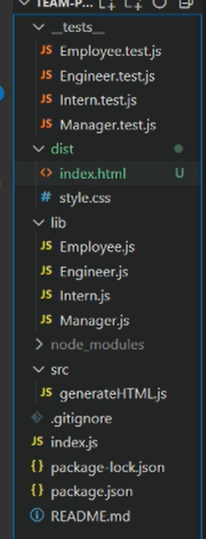

When you open the index.html file, you will see the Team Profile page that has been generated with your input.

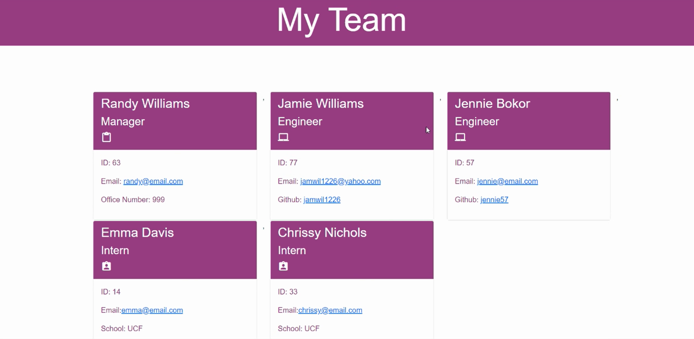

If you click on an employee's email address, an email service provider will open up on your screen. 

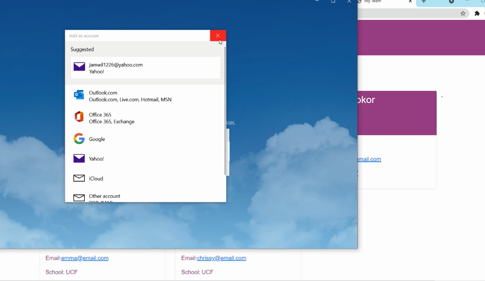

Each Engineer will also have a GitHub link that you can click on.

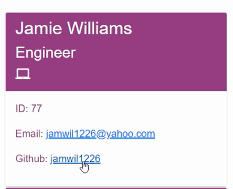

When you click on the GitHub link, you will be directed to the corresponding GitHub page.

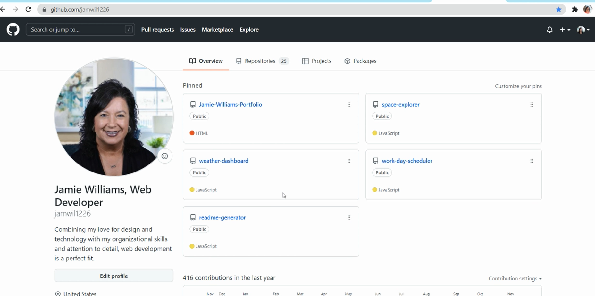

By clicking the back arrow, you will then be brought back to your Team Profile.

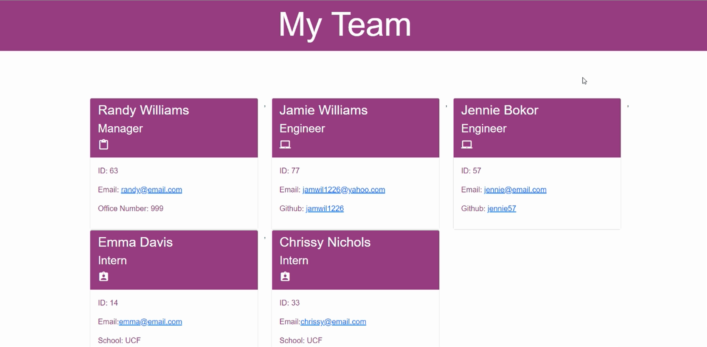

## License
The license for this project is the MIT.

Copyright © 2021

## Contributor
Jamie Williams

GitHub: [@jamwil1226](https://github.com/jamwil1226/)

## Addtional Contributors
Additional Contributors welcome! Reach out to me if you are interested!

## Testing
This app was tested using Jest with all tests passing.

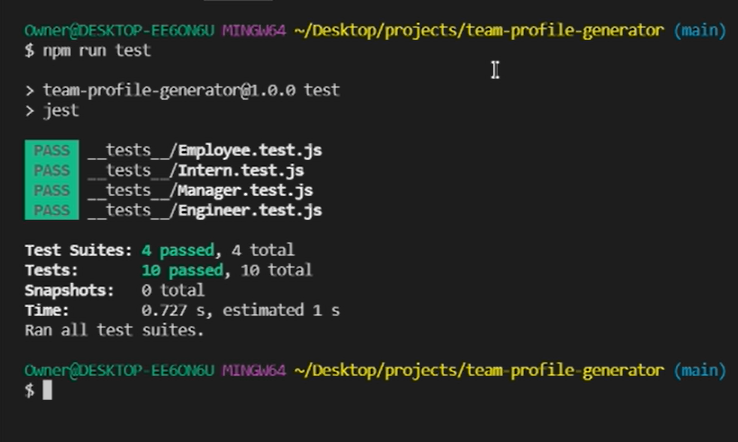

## Demo
Watch this demo to see the Team Profile Generator in action!
https://www.loom.com/share/75eef8b481534bcf8f4f376c4759cb5a

## Questions
*If you have any questions, please reach out to me at* 

GitHub: [@jamwil1226](https://github.com/jamwil1226/)

Email: [jamwil1226@yahoo.com](mailto:jamwil1226@yahoo.com)

### I hope you enjoy using this Team Profile Generator! I welcome all contributions and feedback!

### I look forward to hearing from you!

### _Jamie Williams_ 

